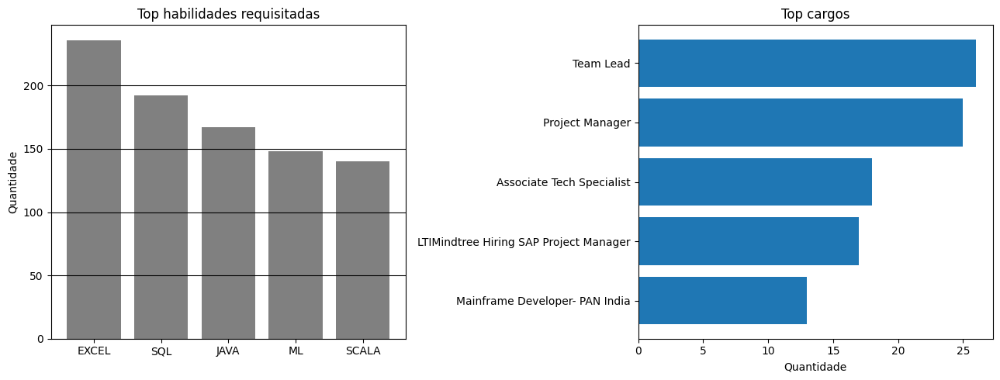
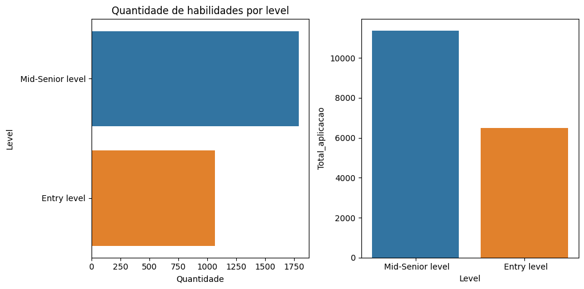
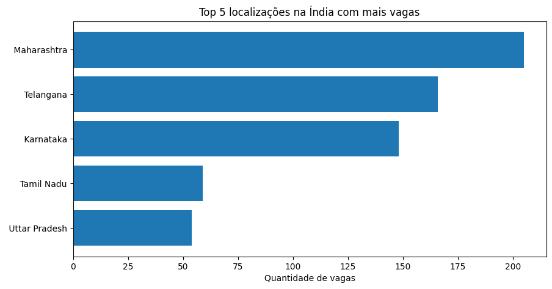

# Análise de vagas para empregos em TI - Python

## 📝 Descrição do projeto
Projeto criado para realizar análise sobre as vagas na região da Índia, extraídos do Linkedin.
Esse projeto, foi desenvolvida usando a linguagem Python e feita no ambiente do Google Colab.
Foram aplicadas técnicas como coleta de dados, limpeza, tratamento e análise exploratória,
com o objetivo de obter insights sobre o mercado de trabalho.

## 🎲 Dados
Os dados utilizados foram obtidos no Kaggle
- Dataset: Job Dataset
- Link: https://www.kaggle.com/datasets/joebeachcapital/linkedin-jobs

## 🛠️ Ferramentas
- Google Collab
- Kaggle API
- Python

biliotecas do Python utilizadas:
- os
- Kaggle
- Pandas
- Matplotlib
- Seaborn

## 🔄 Processo de obtenção, limpeza e tratamento dos dados
A obtenção dos dados foram realizadas a partir do Python, utilizando a API do Kaggle, nesta parte, foram utilizadas ferramentas de apoio como o ChatGPT, para o auxílio ao processo de aprendizado e dúvidas.
Após a obtenção e o carregamento dos dados, foram aplicadas etapas de limpeza, tratamento e análise exploratória.

Ao carregas os dados, foram indentificados que as colunas 'Level'(nível do cargo) e 'Involvement'(regime de trabalho) estavam invertidas. Para corrigir, foi preciso ajustar os nomes das colunas para as corretas.

## 📊 Gráficos gerados 

  <table align = "center">
    <tr>
      <td align = "center">
         
      </td>
    </tr>
    <tr>
      <td align = "center">
        
    </tr>
    <tr>
      <td align = "center">
        
    </tr>
  </table>

## ❓ Perguntas
Este projeto busca responder algumas das seguintes questões:

- Quais as habilidades e os cargos mais requisitadas no mercado?
- Quais as localizações onde mais tem vagas?
- Quais são as principais diferenças entre vagas de Entry Level e Mid Level?
- As vagas de emprego estão concentradas em regiões mais desenvolvidas da Índia?

## 💡 Insights obtidos

- Observa-se que as habilidades mais requisitadas foram Excel, SQL, Java, demonstrando que existe uma forte demanda em habilidades com ferramentas analíticas no mercado de trabalho.
- Cargos de Team Lead e Project Manager concentram o maior número de vagas, indicando uma demanda em funções de liderança e coordenação de equipes.
- Regiões da Índica como Maharashtra, Telangana e Karnataka são as regiões onde possuem mais oportunidades de empregos, com mais de 120 vagas por região, enquanto Tamil Nadu e Uttar Pradesh, mesmo sendo as regiões com mais vagas, observa-se 
um menor volume de vagas, com menos de 100 vagas. Essa diferença pode estar relacionada ao fato de estados como Maharashtra, Telangana e Karnataka concentrarem grandes centros urbanos.
- Mid-Senior level teve uma quantidade maior em aplicações e exigem um número mais elevado de habilidades do que o entry-level, sugerindo que os candidatos possuem mais competências e buscam oportunidades de maior valorização e significa uma maior competitividade no mercado de trabalho para esse nível, também podemos dizer que essas posições tendem a ofereçer salários mais altos, atraindo um número maior de profissionais para essas vagas.

